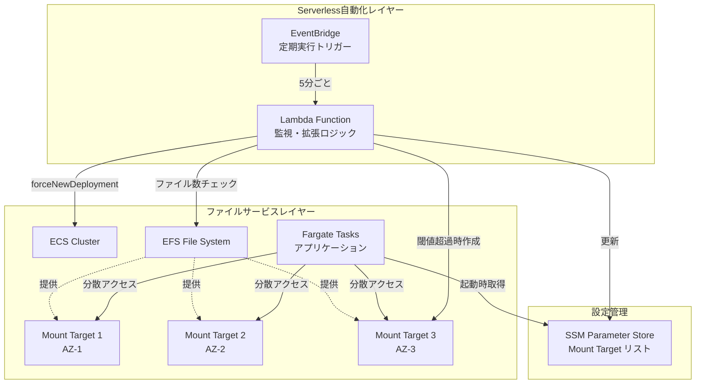

# 設計書

## 概要

本設計書は、AWS Serverlessアーキテクチャを使用したEFS Mount Targetの自動スケーリングシステムの詳細設計を記述する。システムは、EventBridge、Lambda、Fargate、EFS、SSM Parameter Storeを組み合わせて、ファイル数の増加に応じて自動的にMount Targetを追加し、ファイルアクセスを複数のネットワーク接続点に分散させる。

## アーキテクチャ

### システム構成図



### アーキテクチャの特徴

1. **イベント駆動型**: EventBridgeによる定期実行で、システムの状態を継続的に監視
2. **サーバーレス**: Lambda関数により、インフラ管理の負担を最小化
3. **動的スケーリング**: ファイル数に応じて自動的にMount Targetを追加
4. **負荷分散**: ハッシュベースのルーティングにより、複数のMount Targetに均等にアクセスを分散
5. **設定の一元管理**: SSM Parameter Storeにより、設定を集中管理

## コンポーネントとインターフェース

### 1. EventBridge Rule

**責務**: Lambda関数を定期的に実行するトリガーを提供

**設定**:
- スケジュール式: `rate(5 minutes)` または `cron(*/5 * * * ? *)`
- ターゲット: Lambda関数

**インターフェース**:
- 出力: Lambda関数の非同期呼び出し

### 2. Lambda Function (監視・拡張)

**責務**: 
- EFS上のファイル数を監視
- 閾値超過時に新しいMount Targetを作成
- SSM Parameter Storeを更新
- Fargateサービスのローリングアップデートを実行

**入力**:
- 環境変数:
  - `EFS_FILE_SYSTEM_ID`: EFSファイルシステムID
  - `TARGET_DIRECTORY`: 監視対象ディレクトリパス
  - `FILE_COUNT_THRESHOLD`: ファイル数閾値（デフォルト: 100000）
  - `SSM_PARAMETER_NAME`: SSM Parameter Storeのパラメータ名
  - `ECS_CLUSTER_NAME`: ECSクラスター名
  - `ECS_SERVICE_NAME`: ECSサービス名
  - `VPC_ID`: VPC ID
  - `SECURITY_GROUP_ID`: セキュリティグループID

**出力**:
- CloudWatch Logs: 実行ログ
- SSM Parameter Store: 更新されたMount Targetリスト
- ECS Service: 強制デプロイメント

**主要な処理フロー**:
```python
def lambda_handler(event, context):
    # 1. EFSをマウント（Lambda実行環境）
    # 2. ターゲットディレクトリのファイル数をカウント
    # 3. 閾値チェック
    # 4. 閾値超過の場合:
    #    a. 既存のMount Targetを取得
    #    b. 利用可能なサブネットを特定
    #    c. 新しいMount Targetを作成
    #    d. Mount Targetの作成完了を待機
    #    e. SSM Parameter Storeを更新
    #    f. ECS Serviceの強制デプロイメントを実行
    # 5. ログ出力
```

### 3. SSM Parameter Store

**責務**: Mount Targetのリストを保存し、Lambda関数とFargateサービス間で共有

**パラメータ形式**:
```json
{
  "mount_targets": [
    {
      "mount_target_id": "fsmt-12345678",
      "ip_address": "10.0.1.100",
      "availability_zone": "ap-northeast-1a",
      "subnet_id": "subnet-12345678"
    },
    {
      "mount_target_id": "fsmt-87654321",
      "ip_address": "10.0.2.100",
      "availability_zone": "ap-northeast-1c",
      "subnet_id": "subnet-87654321"
    }
  ]
}
```

**インターフェース**:
- 書き込み: Lambda関数（PutParameter API）
- 読み取り: Fargateサービス（GetParameter API）

### 4. Fargate Service

**責務**:
- SSM Parameter Storeから最新のMount Target情報を取得
- 複数のMount Targetをマウント
- ファイルアクセスを複数のMount Targetに分散

**起動時処理**:
```python
def initialize():
    # 1. SSM Parameter Storeから設定を取得
    # 2. 各Mount TargetをNFSマウント
    #    - マウントポイント: /mnt/efs-0, /mnt/efs-1, /mnt/efs-2, ...
    # 3. マウント成功/失敗をログに記録
    # 4. アプリケーションを起動
```

**ファイルアクセスロジック**:
```python
def get_file_path(original_path, mount_targets):
    # 1. ファイルパスのハッシュ値を計算
    hash_value = hash(original_path)
    
    # 2. Mount Target数でモジュロ演算
    index = hash_value % len(mount_targets)
    
    # 3. 選択されたMount Targetのマウントポイントを使用
    mount_point = f"/mnt/efs-{index}"
    
    # 4. 完全なファイルパスを構築
    return os.path.join(mount_point, original_path)
```

### 5. EFS File System

**責務**: 大規模ファイルストレージを提供

**設定**:
- パフォーマンスモード: General Purpose または Max I/O
- スループットモード: Bursting または Provisioned
- 暗号化: 有効化推奨

**Mount Target**:
- 各Availability Zoneに1つのMount Targetを配置
- 各Mount Targetは専用のENI（Elastic Network Interface）を持つ

## データモデル

### Mount Target情報

```typescript
interface MountTarget {
  mount_target_id: string;      // Mount Target ID (例: fsmt-12345678)
  ip_address: string;            // IPアドレス (例: 10.0.1.100)
  availability_zone: string;     // AZ (例: ap-northeast-1a)
  subnet_id: string;             // サブネットID (例: subnet-12345678)
  lifecycle_state: string;       // 状態 (available, creating, deleting)
}
```

### Lambda実行結果

```typescript
interface LambdaExecutionResult {
  timestamp: string;             // 実行時刻
  file_count: number;            // カウントされたファイル数
  threshold: number;             // 設定された閾値
  threshold_exceeded: boolean;   // 閾値超過フラグ
  new_mount_target_created: boolean;  // 新規Mount Target作成フラグ
  new_mount_target_id?: string;  // 作成されたMount Target ID
  deployment_triggered: boolean; // デプロイメント実行フラグ
  error?: string;                // エラーメッセージ
}
```

### Fargateサービス設定

```typescript
interface FargateServiceConfig {
  efs_file_system_id: string;    // EFSファイルシステムID
  mount_targets: MountTarget[];  // Mount Targetリスト
  ssm_parameter_name: string;    // SSMパラメータ名
}
```

## 正確性プロパティ

*プロパティとは、システムの全ての有効な実行において真であるべき特性や動作のことです。これは、人間が読める仕様と機械で検証可能な正確性保証の橋渡しとなります。*

### プロパティ 1: ファイル数カウントの正確性

*任意の* EFSディレクトリに対して、Lambda関数がカウントするファイル数は、実際のファイル数と一致する必要がある

**検証: 要件 1.2**

### プロパティ 2: 閾値判定の一貫性

*任意の* ファイル数と閾値の組み合わせに対して、ファイル数が閾値を超える場合にのみスケーリング処理が実行される必要がある

**検証: 要件 1.3**

### プロパティ 3: Mount Target作成の冪等性

*任意の* サブネットに対して、同じサブネットに対してMount Target作成を複数回実行しても、1つのMount Targetのみが存在する必要がある

**検証: 要件 1.4**

### プロパティ 4: SSM Parameter Storeの更新整合性

*任意の* Mount Targetリストに対して、SSM Parameter Storeに保存されたデータを取得すると、保存したデータと同じ内容が返される必要がある（ラウンドトリップ）

**検証: 要件 1.5, 2.1**

### プロパティ 5: ハッシュベースルーティングの一貫性

*任意の* ファイルパスに対して、同じファイルパスに対するハッシュ計算は常に同じMount Targetインデックスを返す必要がある

**検証: 要件 3.1, 3.2, 3.4**

### プロパティ 6: ハッシュベースルーティングの分散性

*任意の* ファイルパスのセットに対して、各Mount Targetに割り当てられるファイル数の偏りが許容範囲内である必要がある（完全に均等でなくても、極端な偏りがないこと）

**検証: 要件 3.3**

### プロパティ 7: エラー時の状態保持

*任意の* エラー条件に対して、エラーが発生した場合でも、既存のMount Target設定は変更されず、システムは以前の状態を維持する必要がある

**検証: 要件 6.1, 6.2, 6.3**

### プロパティ 8: Mount失敗時のフォールバック

*任意の* Mount Targetリストに対して、一部のMount Targetのマウントに失敗しても、少なくとも1つのMount Targetが利用可能であればサービスは起動する必要がある

**検証: 要件 6.5**

## エラー処理

### Lambda関数のエラー処理

1. **EFSアクセスエラー**
   - 原因: ネットワーク問題、権限不足、EFSマウント失敗
   - 対応: エラーログを記録し、処理を中断。CloudWatch Alarmで通知
   - 要件: 6.1

2. **利用可能なサブネットなし**
   - 原因: 全てのAZに既にMount Targetが存在
   - 対応: 警告ログを記録し、Mount Target作成をスキップ。正常終了
   - 要件: 6.2

3. **Mount Target作成失敗**
   - 原因: AWS APIエラー、リソース制限
   - 対応: エラーログを記録し、SSM更新とデプロイメントをスキップ
   - 要件: 6.3

4. **SSM Parameter Store更新失敗**
   - 原因: 権限不足、ネットワーク問題
   - 対応: エラーログを記録し、デプロイメントをスキップ。既存の設定を維持
   - 要件: 6.3

5. **ECS UpdateService失敗**
   - 原因: 権限不足、サービスが存在しない
   - 対応: エラーログを記録。SSM Parameter Storeは更新済みなので、次回のデプロイメント時に反映される

### Fargateサービスのエラー処理

1. **SSM Parameter Store取得失敗**
   - 原因: 権限不足、パラメータが存在しない
   - 対応: デフォルト設定（初期のMount Targetリスト）を使用してサービスを起動
   - 要件: 6.4

2. **Mount Target マウント失敗**
   - 原因: ネットワーク問題、Mount Targetが利用不可
   - 対応: 失敗したMount Targetをスキップし、他のMount Targetを使用
   - 要件: 6.5

3. **全てのMount Targetマウント失敗**
   - 原因: 深刻なネットワーク問題、設定エラー
   - 対応: サービス起動を中断し、エラーログを記録。コンテナは失敗状態となり、ECSが再起動を試みる

## テスト戦略

### ユニットテスト

1. **Lambda関数のテスト**
   - ファイル数カウント機能のテスト（モックEFSを使用）
   - 閾値判定ロジックのテスト
   - Mount Target作成ロジックのテスト（モックAWS APIを使用）
   - SSM Parameter Store更新のテスト（モックAWS APIを使用）

2. **Fargateアプリケーションのテスト**
   - SSM Parameter Store取得のテスト
   - ハッシュベースルーティングロジックのテスト
   - Mount失敗時のフォールバックロジックのテスト

### プロパティベーステスト

本システムでは、**Hypothesis**（Python）をプロパティベーステストライブラリとして使用します。各プロパティベーステストは最低100回の反復実行を行います。

1. **ファイル数カウントの正確性テスト**
   - **Feature: efs-mount-target-autoscaling, Property 1: ファイル数カウントの正確性**
   - ランダムな数のファイルを生成し、カウント関数が正確な数を返すことを検証

2. **閾値判定の一貫性テスト**
   - **Feature: efs-mount-target-autoscaling, Property 2: 閾値判定の一貫性**
   - ランダムなファイル数と閾値を生成し、判定ロジックが正しく動作することを検証

3. **SSM Parameter Storeのラウンドトリップテスト**
   - **Feature: efs-mount-target-autoscaling, Property 4: SSM Parameter Storeの更新整合性**
   - ランダムなMount Targetリストを生成し、保存→取得のラウンドトリップで同じデータが返されることを検証

4. **ハッシュベースルーティングの一貫性テスト**
   - **Feature: efs-mount-target-autoscaling, Property 5: ハッシュベースルーティングの一貫性**
   - ランダムなファイルパスを生成し、同じパスに対して常に同じMount Targetが選択されることを検証

5. **ハッシュベースルーティングの分散性テスト**
   - **Feature: efs-mount-target-autoscaling, Property 6: ハッシュベースルーティングの分散性**
   - 大量のランダムなファイルパスを生成し、各Mount Targetへの分散が許容範囲内であることを検証（カイ二乗検定を使用）

6. **エラー時の状態保持テスト**
   - **Feature: efs-mount-target-autoscaling, Property 7: エラー時の状態保持**
   - ランダムなエラー条件を生成し、エラー発生時に既存の設定が変更されないことを検証

7. **Mount失敗時のフォールバックテスト**
   - **Feature: efs-mount-target-autoscaling, Property 8: Mount失敗時のフォールバック**
   - ランダムなMount Targetリストと失敗パターンを生成し、少なくとも1つが成功すればサービスが起動することを検証

### 統合テスト

1. **エンドツーエンドテスト**
   - テスト環境でEFS、Lambda、Fargate、SSM Parameter Storeを実際にデプロイ
   - ファイル数を閾値以上に増やし、自動スケーリングが実行されることを確認
   - Fargateサービスが新しいMount Targetを認識し、負荷分散が機能することを確認

2. **負荷テスト**
   - 大量のファイルアクセスを実行し、複数のMount Targetに均等に分散されることを確認
   - パフォーマンスメトリクス（レイテンシ、スループット）を測定

## セキュリティ考慮事項

### IAM権限

**Lambda実行ロール**:
```json
{
  "Version": "2012-10-17",
  "Statement": [
    {
      "Effect": "Allow",
      "Action": [
        "elasticfilesystem:DescribeMountTargets",
        "elasticfilesystem:CreateMountTarget",
        "elasticfilesystem:DescribeFileSystems"
      ],
      "Resource": "*"
    },
    {
      "Effect": "Allow",
      "Action": [
        "ssm:PutParameter",
        "ssm:GetParameter"
      ],
      "Resource": "arn:aws:ssm:*:*:parameter/app/efs/*"
    },
    {
      "Effect": "Allow",
      "Action": [
        "ecs:UpdateService",
        "ecs:DescribeServices"
      ],
      "Resource": "*"
    },
    {
      "Effect": "Allow",
      "Action": [
        "ec2:DescribeSubnets",
        "ec2:DescribeNetworkInterfaces",
        "ec2:CreateNetworkInterface",
        "ec2:DeleteNetworkInterface"
      ],
      "Resource": "*"
    },
    {
      "Effect": "Allow",
      "Action": [
        "logs:CreateLogGroup",
        "logs:CreateLogStream",
        "logs:PutLogEvents"
      ],
      "Resource": "*"
    }
  ]
}
```

**Fargate実行ロール**:
```json
{
  "Version": "2012-10-17",
  "Statement": [
    {
      "Effect": "Allow",
      "Action": [
        "ssm:GetParameter"
      ],
      "Resource": "arn:aws:ssm:*:*:parameter/app/efs/*"
    },
    {
      "Effect": "Allow",
      "Action": [
        "logs:CreateLogGroup",
        "logs:CreateLogStream",
        "logs:PutLogEvents"
      ],
      "Resource": "*"
    }
  ]
}
```

### ネットワークセキュリティ

1. **セキュリティグループ**
   - Lambda関数: EFS Mount Targetへのアクセスを許可（NFS: TCP 2049）
   - Fargate Service: EFS Mount Targetへのアクセスを許可（NFS: TCP 2049）
   - EFS Mount Target: Lambda関数とFargateサービスからのアクセスを許可

2. **VPC設定**
   - Lambda関数とFargateサービスは同じVPC内に配置
   - プライベートサブネットの使用を推奨

### データ暗号化

1. **転送中の暗号化**: EFS Mount時にTLS（Transport Layer Security）を有効化
2. **保管時の暗号化**: EFSファイルシステムで暗号化を有効化（AWS KMS使用）

## デプロイメント戦略

### 初期デプロイメント

1. VPCとサブネットの準備（最低2つのAZ）
2. EFSファイルシステムの作成
3. 初期Mount Targetの作成（2つのAZ）
4. SSM Parameter Storeに初期設定を保存
5. Lambda関数のデプロイ
6. EventBridge Ruleの作成
7. Fargateサービスのデプロイ

### 更新デプロイメント

1. Lambda関数のコード更新: ブルー/グリーンデプロイメント（Lambda Aliasを使用）
2. Fargateサービスの更新: ローリングアップデート（ECS標準機能）

## 監視とアラート

### CloudWatch メトリクス

1. **Lambda関数**
   - 実行回数
   - エラー回数
   - 実行時間
   - カスタムメトリクス: ファイル数、閾値超過回数

2. **EFS**
   - ClientConnections: Mount Targetへの接続数
   - DataReadIOBytes: 読み取りバイト数
   - DataWriteIOBytes: 書き込みバイト数
   - PercentIOLimit: I/O制限の使用率

3. **Fargate Service**
   - CPUUtilization
   - MemoryUtilization
   - カスタムメトリクス: Mount Target別のアクセス数

### CloudWatch Alarms

1. Lambda関数のエラー率が閾値を超えた場合
2. EFSのPercentIOLimitが80%を超えた場合
3. Fargateサービスのタスクが起動失敗した場合

## パフォーマンス最適化

### Lambda関数の最適化

1. **メモリ割り当て**: 1024MB以上を推奨（ファイル数カウント処理のため）
2. **タイムアウト**: 5分（Mount Target作成待機時間を考慮）
3. **同時実行数制限**: 1（複数のLambda関数が同時にMount Targetを作成しないようにする）

### EFSの最適化

1. **パフォーマンスモード**: 
   - 小規模（< 1000ファイル/秒）: General Purpose
   - 大規模（> 1000ファイル/秒）: Max I/O

2. **スループットモード**:
   - 予測可能な負荷: Provisioned Throughput
   - 変動する負荷: Bursting

### Fargateサービスの最適化

1. **タスク定義**: 
   - CPU: 2 vCPU以上
   - メモリ: 4GB以上
2. **タスク数**: 負荷に応じてAuto Scalingを設定
